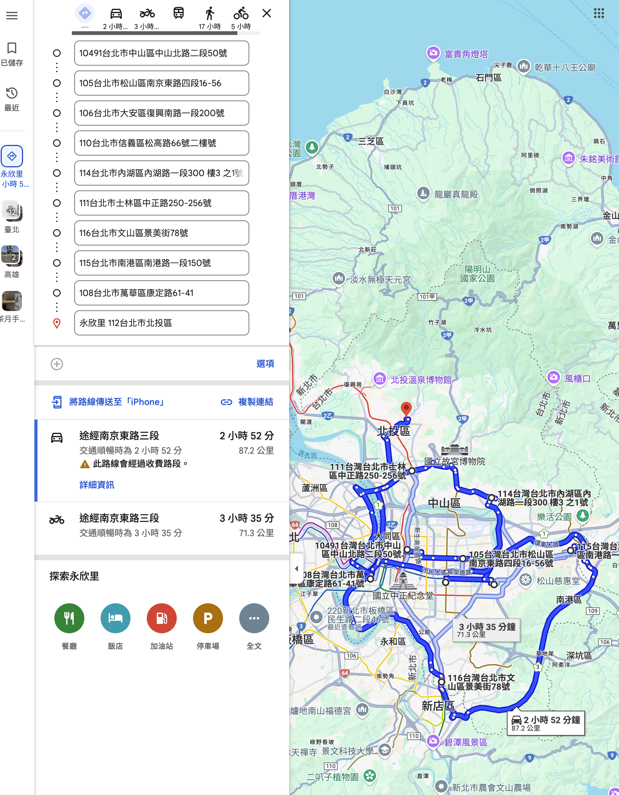

# MultiPointRouting

多點路線規劃系統，允許使用者規劃多個點之間的最優路線，並透過 LINE Bot 發送路線資訊。




## 專案概述

MultiPointRouting 是一個整合了地址轉換、路徑規劃和通知功能的系統，主要功能包括：

- 批次上傳地址（手動輸入或透過 CSV 檔案）
- 自動將地址轉換為經緯度（使用 Google Maps Geocoding API）
- 計算多個地點間的最佳路線（使用 Google Routes API）
- 生成 Google Maps 路線連結
- 透過 LINE Bot 自動發送路線連結給指定用戶

## AI 輔助開發過程

本專案是一個 AI 輔助開發的示範，展示如何利用 AI 工具（如 ChatGPT 和 Replit）快速將想法轉化為實際專案。

### 專案由來

本專案源於一次社群活動中發現的需求。在活動中，發現人們對於多點路徑規劃和自動通知的需求，但當時尚未聽取詳細的需求內容，僅憑想像構思了這個專案的雛形。

### 與 ChatGPT 的互動過程

1. 初步討論專案可行性和功能設計
2. 讓 ChatGPT 協助生成提示詞（Prompt）
3. 將提示詞提交至 Replit 的 vibe coding 平台
4. 獲取初始程式碼並發布到 Git

### 用於 Replit 的提示詞

以下是與 ChatGPT 討論後，生成的用於 Replit 平台的詳細提示詞：

```
【專案名稱】
Replit 多點路徑規劃及 LINE Bot 通知工具

【專案目標】
建立一個完整的應用程式，讓使用者可以批次上傳地址（或透過 CSV 檔案上傳），系統將自動：
1. 將地址利用 Google Maps Geocoding API 轉換為經緯度。
2. 透過 Google Routes API（或其他路由 API）計算多個地址間的基本路徑規劃，產生一條最佳路線。
3. 產生一個 Google Maps 路線連結，可在瀏覽器中直接打開檢視整個路線規劃結果。
4. 整合 LINE Bot 功能，利用 LINE Messaging API 自動發送該 Google Maps 路線連結給指定的單位或用戶。

【技術架構與需求】
1. 開發環境：Replit（不使用 Firebase 服務），可採用 Node.js 或 Python 作為後端程式語言。
2. 地址輸入與處理：
   - 前端頁面提供地址輸入介面或 CSV 檔案上傳功能。
   - 後端會接收到地址資料後，透過 Google Maps Geocoding API 將地址轉換為經緯度（lat, lng）。
3. 路徑規劃：
   - 利用 Google Routes API（或其他簡單的路由 API）依據地址的經緯度資訊計算路線，生成可用於 Google Maps 的路線連結（例如：透過 URL 參數構造，將各點依序排列）。
   - 規劃邏輯不需要太複雜，只需要基本的多點路徑規劃。
4. LINE Bot 整合：
   - 使用 LINE Messaging API（可參考現有的 Node.js 或 Python SDK）實作 LINE Bot 功能，當路線規劃完成後，自動發送產生的 Google Maps 路線連結到指定的 LINE 帳號。
   - 需要設定好 LINE Bot 的 webhook、channel access token 等認證資訊。
5. 部署與測試：
   - 利用 Replit 部署 Web 應用與 API 服務，並確保前後端能順利連線及運作。
   - 前端可使用簡單的 HTML/CSS/JavaScript 或搭配框架（如 Vue.js）建構使用介面，供使用者上傳資料與查詢。

【整體提示詞示例】
「請根據以下需求，建立一個完整的應用程式，運行於 Replit 平台，不使用 Firebase 服務，具備以下功能：
1. 提供一個前端頁面，讓使用者可以手動輸入多個地址，或上傳一個包含地址的 CSV 檔案。
2. 系統接收到地址後，利用 Google Maps Geocoding API 將每個地址轉換為經緯度資料。
3. 利用 Google Routes API（或其他適合的路由 API）依據這些經緯度資料，計算出一條基本的最佳路線，並生成一個 Google Maps 路線連結，讓使用者可以直接點擊在瀏覽器中開啟 Google Maps 來檢視規劃結果。
4. 整合 LINE Bot，使用 LINE Messaging API，當路線計算完成後，將生成的 Google Maps 路線連結自動傳送到指定的 LINE 帳號，達到通知單位的目的。
5. 請使用 Node.js（例如搭配 Express）或 Python（例如搭配 Flask/FastAPI）實作後端 API，並在程式中附上詳細的註解和部署說明。

請根據以上需求，產出完整的程式碼、部署步驟說明以及整合測試方法，讓這個工具能夠從地址輸入、路線計算、生成 Google Maps 連結到透過 LINE Bot 通知單位全部自動化完成。」

【附加說明】
- 請確保程式碼中包含 Google Maps Geocoding API 與 Routes API 的呼叫範例（請使用正確的 API Key 並加上註解說明如何設定）。
- LINE Bot 部分請包含 LINE Messaging API 的整合範例，並附上 webhook 設定的範例與 Channel Access Token 管理方式。
- 整個應用需在 Replit 上順利運行，並能接受外部請求。
- 請在程式中提供基本錯誤處理，並附上注釋說明各模組的功能與流程。」

### AI 輔助開發的學習要點

透過本專案，可以學習到：

1. 如何將抽象需求轉化為具體的 AI 提示詞
2. 利用 ChatGPT 幫助優化提示詞結構和內容
3. 在 Replit 等平台使用 AI 生成完整專案代碼
4. 如何評估和修改 AI 生成的代碼以符合實際需求

## 安裝

### 前置需求

- Node.js 14+
- npm 或 yarn
- Google Maps API 金鑰（包含 Geocoding API 和 Routes API 權限）
- LINE 開發者帳號（用於設置 LINE Bot）

### 安裝步驟

1. 複製專案到本地

```bash
git clone https://github.com/your-username/MultiPointRouting.git
cd MultiPointRouting
```

2. 安裝依賴

```bash
npm install
```

3. 設定環境變數

```bash
cp .env.example .env
```

4. 編輯 `.env` 文件，填入必要的 API 金鑰和設定

```
# Google Maps API 設定
GOOGLE_MAPS_API_KEY=你的Google_API金鑰

# LINE Bot 設定
LINE_CHANNEL_ACCESS_TOKEN=你的LINE頻道存取權杖
LINE_CHANNEL_SECRET=你的LINE頻道密鑰

# 伺服器設定
PORT=3000
HOST=localhost
```

5. 啟動開發伺服器

```bash
npm run dev
```

## 使用方法

### 基本操作流程

1. 訪問應用首頁（預設為 `http://localhost:3000`）
2. 選擇輸入方式：
   - 手動輸入多個地址
   - 上傳包含地址的 CSV 檔案（格式：每行一個地址，或按提供的範本格式）
3. 點擊「規劃路線」按鈕
4. 系統處理後會顯示規劃結果，包含：
   - 地圖視覺化顯示
   - Google Maps 路線連結
   - 發送至 LINE 的選項


### LINE Bot 操作

1. 掃描 LINE Bot QR Code 加為好友（需先在開發者後台設置）
2. 在系統中選擇「發送至 LINE」後，Bot 會自動發送路線連結
3. 點擊 LINE 訊息中的連結可直接在 Google Maps 中查看完整路線


### API 使用

系統也提供 API 介面供其他應用程式呼叫：

```
POST /api/route
Content-Type: application/json

{
  "addresses": ["地址1", "地址2", "地址3", ...],
  "returnToStart": true,
  "notifyLine": true
}
```

完整 API 文件請參考 `/docs` 路徑。

## 技術架構

- 前端：HTML、CSS、JavaScript
- 後端：Node.js、Express
- 資料庫：SQLite / PostgreSQL
- API 整合：Google Maps API、LINE Messaging API


## 貢獻

歡迎提交問題或建議，以幫助改進這個專案！

## 授權

本專案採用 MIT 授權條款，詳情請參閱 [LICENSE](LICENSE) 文件。 